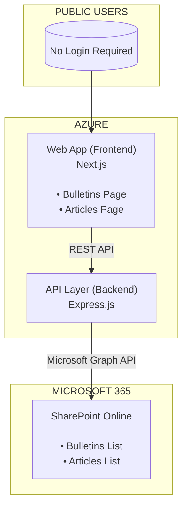

# KTMB2 POC - High Level Architecture

## Scope: Public Access Portal (Bulletins & Articles)

---

## Summary

| Component | Technology | Purpose |
|-----------|------------|---------|
| Frontend | Next.js on Azure | Public-facing web pages |
| Backend | Express.js | REST API to SharePoint |
| Data | SharePoint Lists | Content storage (Bulletins, Articles) |

---

## What This POC Demonstrates

1. **Azure-hosted frontend** serving public content
2. **SharePoint as data backend** - no separate database needed
3. **Read-only public access** - no authentication required
